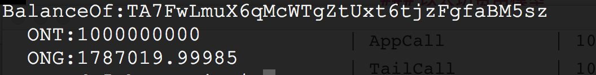
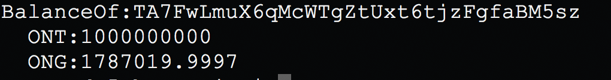

<h1 align="center">Ontology 智能合约费用模型</h1>

## 1. GAS Limit
Gas limit是在执行智能合约的opcode过程中计步时使用，理论上智能合约越复杂，需要的gas limit的数量越高，ontology交易设定最低的Gas limit数量是30000

## 2. GAS Price
Gas price是给执行opcode定价，gas price的价格越高，共识节点会优先打包该笔交易。

## 3. Transaction Fee

交易费是gas limit 和 gas price乘积，实际的交易费分以下三种情形

### 执行opcode步数等于gas limit

**transaction fee =  gas price * gas limit**

### 执行opcode步数大于gas limit

**transaction fee =  gas price * gas limit**

交易失败，但gas不会退还

### 执行opcode步数小于gas limit
**transaction fee =  gas price * (opcode实际消耗)**

多余的gas 会退还


## 4. opcode 定价

| Function         | Gas limit |
| ---------------- | --------- |
| GetHeader        | 100       |
| GetBlock         | 200       |
| GetTransaciton   | 100       |
| GetContract      | 100       |
| Deploy contract  | 10000000  |
| Migrate contract | 10000000  |
| Get storage      | 100       |
| Put storage      | 1000/KB   |
| Delete storage   | 100       |
| Checkwitness     | 200       |
| Checksig         | 200       |
| AppCall          | 10        |
| TailCall         | 10        |
| SHA1             | 10        |
| SHA256           | 10        |
| HASH160          | 20        |
| HASH256          | 20        |
| 普通OPCODE       | 1         |


## Example

使用Ontology CLI发起一笔转账交易，演示如何使用gas price 和gas limit，请保证有足够的ONG


- 查询余额：

```
./ontology asset balance TA7FwLmuX6qMcWTgZtUxt6tjzFgfaBM5sz
```



- 转账：
```
./ontology asset transfer --from TA7FwLmuX6qMcWTgZtUxt6tjzFgfaBM5sz  --to TA7FwLmuX6qMcWTgZtUxt6tjzFgfaBM5sz  --amount 1000 --gasprice 5 --gaslimit 40000
```




可以看到，转账1000个ONT，gas price  = 5，gas limit = 40000，最终消耗的gas =  1787019.99985 - 1787019.9997 = 0.00015
